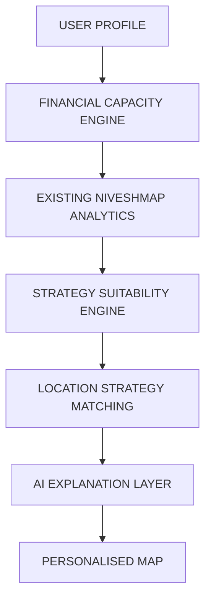

# Personalised Real Estate Strategy Suitability Architecture

This document describes the design and pipeline of the personalized decision-support layer implemented in NiveshMap.

## 1. Pipeline Description

1. **User Profile Intake**:
   - Collects financial inputs (income, available capital, monthly debt obligations, dependents), risk preferences, liquidity constraints, and investment horizons.
   - Restricts data inputs to non-sensitive values (no PII, PAN, or bank details are collected).

2. **Financial Capacity Engine**:
   - Calculates derived indicators: `monthly_income`, `debt_burden_ratio`, `capital_to_income_ratio`, and `dependent_load`.
   - Categorizes users into capacity classes (`CONSTRAINED`, `LIMITED`, `MODERATE`, `STRONG`, `VERY_STRONG`) using thresholds configured in [suitability.yaml](file:///c:/Users/eklav/Desktop/NiveshMap/config/suitability.yaml).

3. **Existing NiveshMap Analytics**:
   - Integrates model scenario price predictions, transit exposures, and Data Readiness scores from the core pipeline.

4. **Strategy Suitability Engine**:
   - Evaluates 5 core strategies: `HOME_PURCHASE`, `RENTAL_FLAT`, `LAND_APPRECIATION`, `SHORT_TERM_RESALE`, and `WAIT_AND_ACCUMULATE_CAPITAL`.
   - Enforces hard gates (e.g., high liquidity or short horizon penalizes long-term land investments).
   - Generates whole-number suitability scores (0-100) and bands (`LOW`, `MODERATE`, `HIGH`, `VERY_HIGH`).

5. **Location Strategy Matching**:
   - Scores supported localities against strategy characteristics.
   - For example, `LAND_APPRECIATION` prioritizes regions with upcoming transit construction (proposed metro) and high scenario variance, while penalizing low Data Readiness.
   - Marks unsupported or low-data regions as `INSUFFICIENT_DATA` rather than ranking them poorly.

6. **AI Explanation Layer**:
   - Employs Google Gemini (`gemini-1.5-flash`) to generate structured summaries comparing strategies and communicating risks.
   - Follows strict instructions: does not calculate/modify scores, does not predict prices, and avoids promotional language (e.g., "guaranteed returns").
   - Falls back to a rules-based engine-generated report if the API is offline.

7. **Personalised Map**:
   - Displays cells colored according to their compatibility match band for the preferred strategy, complete with an explicitly labeled "Strategy Match" legend.

---

## 2. Configuration & Weights
Scoring logic details, penalties, and thresholds are fully customizable and stored in [suitability.yaml](file:///c:/Users/eklav/Desktop/NiveshMap/config/suitability.yaml).
